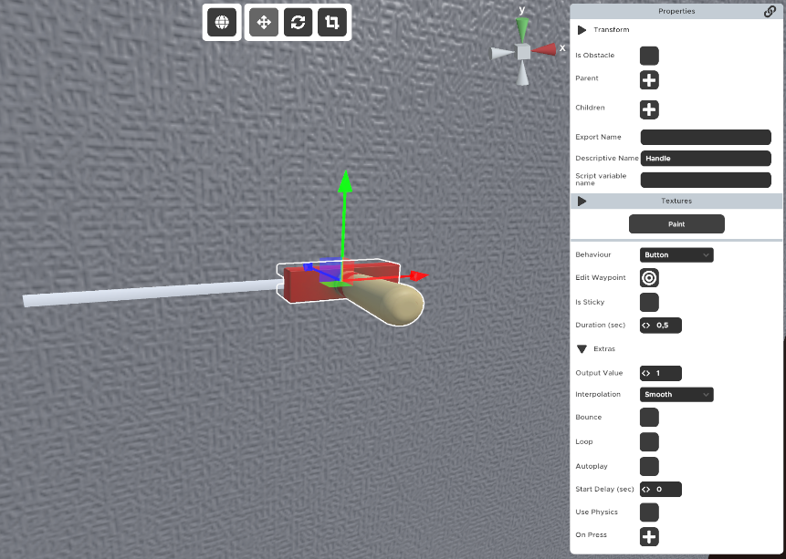
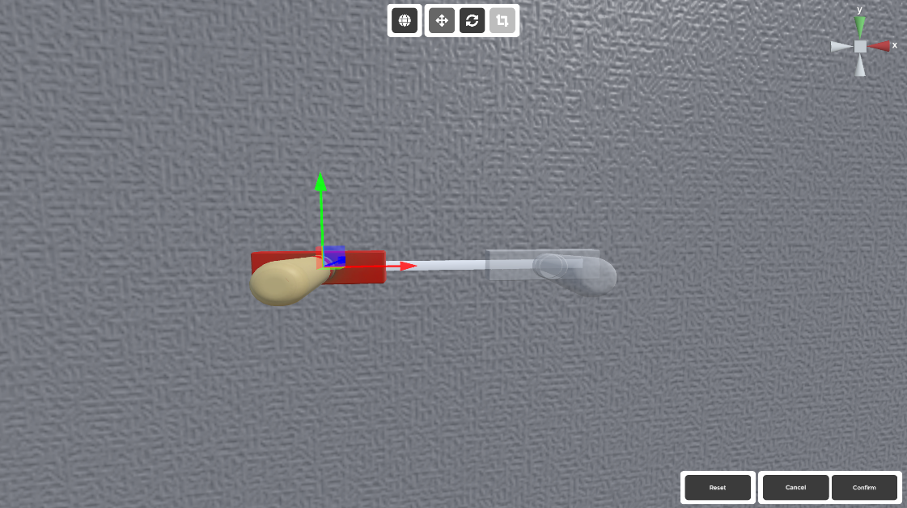
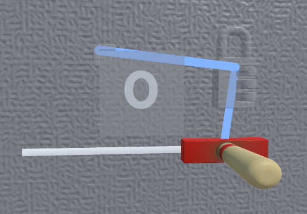

# Button
The button property is used to make an object into a clickable button. In game the cursor turns into a cogwheel when hovering over it, indicating that it is interactable.

:::note
Buttons can not be activated by Animations, other Buttons or any other logical object, only by Autoplay or players.
:::

:::tip
You can make your "clutter" objects be buttons instead of pickups or draggable.
That way your room still offers interaction with items without cluttering the player inventory or messing with your decoration. 
E.g. a button book can easily be lifted with a click to look under it. Another click puts it back down.
:::

### Properties

### :small_orange_diamond:Edit Waypoint

Set the endpoint position and rotation of the movement.

Clicking the button will open the special Button settings screen where you can set the final position of the Button. This determines the endpoint of the movement of the button when it gets pressed. It can flip like a switch, or be pushed down, or spin, or be pulled out.

Here you can move the camera as you move it in the Room Editor (holding right click and using the WASDQE keys for movement) and move the position of the Button prop. Scale changes are ignored for the Button.

:::note
Only the props that are set as children to the prop with the Button behaviour will be animated.
:::

### :small_orange_diamond:Is Sticky

When checked, the button can only be pressed once before it is deactivated.

The button can only be pressed once, then is deactivated and no longer pressable.

### :small_orange_diamond:Duration

Defines the duration of the animation and how much time needs to pass before the end actions are executed.

This determines how fast the button animation will happen. The button activation signal will be sent at the END of the animation!

:::note
"0 seconds" means the position change will happen instantly. 
:::

### :small_orange_diamond:Output Value

Number that will be sent to the targeted props on correct completion.

Numerical value that gets send to a lock when the button is activated. Deactivating it will send a 0. When it is set to `Bounce` it will only send the set value on press and not the 0.

:::tip
This can be used to create password keypads that require buttons to be pressed in order. Use "continous" locks for that purpose. You can check out the already assembled Keypad prop which takes the output of each numbered `Button` and sends it to a `Lock` prop. 
:::

### :small_orange_diamond:Interpolation

Smooth - the start and end speed are smoothed out so it doesn't start or end abruptly.
Linear - keeps the same speed during the entire animation.

Let's you choose between `Smooth` and `Linear`. This effects the way the press animation is handled. 

`Smooth` gives an animation a more natural look, by changing speed at the beginning and end of the animation. Starts slow but speeds up, when it get's near the end it slows down before reaching a full stop.

`Linear` will make the animation move at a constant speed.

### :small_orange_diamond:Bounce

When checked, it will animate back to its original position and send out the 'Output Value'.
When not checked, it has an 'On/Off' state and will toggle between the 'Output Value' and zero.

This will have the animation "bounce" back to its starting position.

The image above shows the setup that is used to show when and how the `Button` sends the `Output Value` or a 0. The `Button` has the `Lock` as an `On Complete` target, and the `Display` targets the `Lock`.

If this is unchecked, the button will stay in the same location it was at the end of the animation. If bounce is not activated, a button has an on/off position and output.

Bounce leads to the button sending an activation signal every time it is pressed. Here in the example there are two bounced buttons. The top one has 1 as the `Output Value`, while the bottom one has 2.

:::tip
The most common issue with button and lock logics is forgetting to add the `Bounce` checkmark!
:::

### :small_orange_diamond:Pause (sec)

Determines the amount of time to wait before bounce.

When the button prop reaches the Waypoint the prop will stay there for `Pause` seconds and then return.

:::note
This property is only active if the `Bounce` property is active
:::

### :small_orange_diamond:Loop

When checked, the animation and the activation signal it sends out is looped

If checked, the animation AND the activation signal it sends out at the end will be looped forever. The button keeps pushing itself.

### :small_orange_diamond:Autoplay

When checked, it is activated as soon as the player starts the room.

Will active the button on its own once when the game starts.

### :small_orange_diamond:Start Delay (sec)

Determines the amount of time to wait before starting the animation. Only works once for looped animations.

The delay determines how long it takes for the animation to happen at first. The delay does NOT apply if a player presses the button! It only applies for the Auto-play. It also does not apply to loops, just to the first instance the button is automatically pressed.

### :small_orange_diamond:Use Physics

If checked the prop will start using physics to interact with the environment and it can no longer be interacted with outside of zoom. If it's parented to another object that is affected by physics (e.g. 'Pickable', 'Draggable') they will constantly interact and push each other away.

Activates the physics interaction, meaning it will push other props that also have physics interactions, like pickable or draggable props.

### :small_orange_diamond:On Press

The targeted props will be triggered once the prop reaches the animation waypoint.

Determines which items get the activation signal and the `Output Value` when the button is pressed and the press animation ended.
