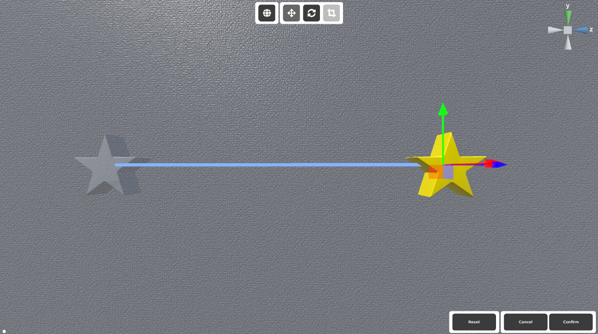

# Slidable (WIP)
Allows you to slide a prop between 2 points.

## Properties

### :small_orange_diamond:Edit End Node

Position of the slidable node with the last index.

Clicking the button will open the special Slidable settings screen where you can set the final position of the Slidable.

Here you can move the camera as you move it in the Room Editor (holding right click and using the WASDQE keys for movement) and move the position of the Slidable prop. Rotation and scale changes will not be regarded for the Slidable.

:::note
Only the props that are set as children to the prop with the Slidable behaviour will be used for sliding.
:::

### :small_orange_diamond:Snap Mode

No Snapping - No snapping will be performed on release.
Closest - Snap to the closest snap point on release.
Starting - Snap to the starting point on release.

Snap mode determines what the Slidable should do after the player lets go of the Slidable. That affects the position of the Slidable and when the connected Locks will be notified of the player stopping the interaction. The output values are determined by closeness. The snap point closest to the slidable will determine the output value.

The examples below demonstrates each mode, with the output value being shown above the Slidable. 

- `No Snapping`

The Slidable will stay at the position it was let go at and the output value will immediately be sent to the locks.

- `Closest`

The Slidable will animate to the closest snap position when let go. The output value will be sent to the connected locks as soon as the Slidable is done animating to the closest snap position.

- `Starting `

The Slidable will animate to the Starting Node when let go. The output value will be sent to the connected locks as soon as the player stops the interaction. The Starting Node can be set by another setting.

### :small_orange_diamond:Additional Snap Points

Number of additional snap points between nodes. If zero, snap is performed between start and end nodes.

Here you can add additional snap points on the line. e.g. if you want a total of 5 snap points, you'll write 3 here, because the start and end points are not counted.

### :small_orange_diamond:Locks

Target locks will receive the node index of the closest node, starting from 0 to the number of nodes - 1. For the snap to 'Closest' mode the 'On Change' triggers when snapping is completed, for other modes it is triggered on release.

This is where you will select which Locks (and their value position) you want the Slidable to send it's current position to. 

### :small_orange_diamond:Starting Node

## Common uses
- Add to drawers that can be opened via sliding.