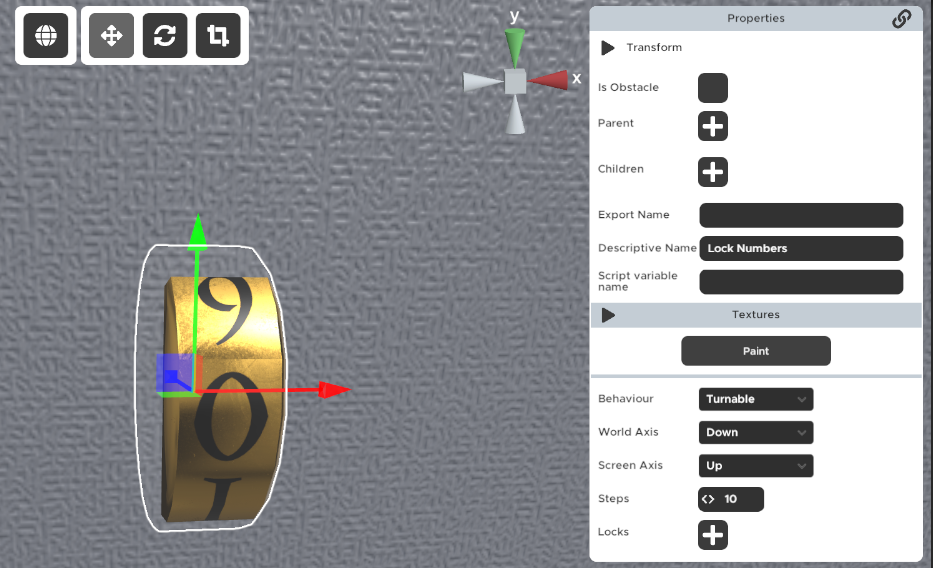
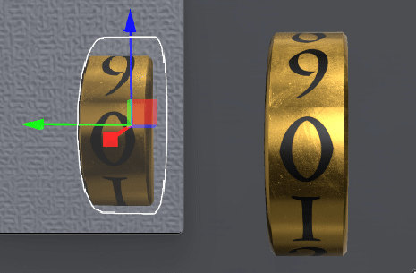
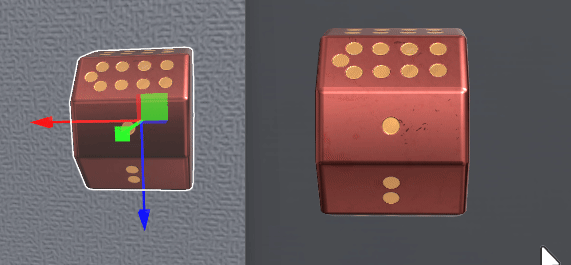

# Turnable
Turnables are used as inputs for `Lock`s or just for allowing the player to rotate a prop. They can give a range of values as output for the `Lock`, starting with 0 and ending with the number of steps you assign -1. They are similar to the `Dial` behaviour, but they require the mouse movement in two directions (e.g. up - down), while the `Dial` requires moving the mouse in a circular motion.

:::tip
Turnables can be everything. A valve, a numbers lock, a statue or even an elephant.
:::

:::tip
Keep in mind that you can retexture your Turnables to have custom faces that show numbers, symbols or whatever else you want!
:::

## Properties

### :small_orange_diamond:World Axis

Determines along which axis the prop will rotate.

This determines along which axis your `Turnable` will turn when moved and in which direction the next value is. You can use the axis example image below to determine which axis will best fit your needs.

:::note
Don't forget to set the axis view to 'local' so you are viewing the correct axis angles!
:::

:::tip
You can also use the rule of the __left thumb__ to easily determine the axis needed and the direction. Check it out at the bottom of this page!
:::

### :small_orange_diamond:Screen Axis

Determines the direction of the mouse movement needed to rotate the prop and increase the value.
Right - Moving the mouse to the Right increases its value.
Right Up - Moving the mouse to the Right or Up increases the value.
...

This determines how the mouse movement affects the turnable. After setting up the `World Axis` correctly you'll know which direction the values will be going up. Now you just need to match that to the movements of the mouse.

When selecting Screen Axis, dragging the object in the selected direction will rotate the object positively, and dragging the object in the opposite of the selected direction will rotate the object negatively.

:::tip
Pay attention to the direction the `Turnable` and the mouse movement. Many people set this wrong for their turnables, which will result in you pulling down a number dial, but instead it will move upwards. Keep an eye on this in your rooms so the players have a good experience!
:::

### :small_orange_diamond:Steps

Determines the number of snap positions. Output value goes from 0 to the number of Steps reduced by one.

This determines how many snap positions the `Turnable` will have and how many different signals it will be able to send. The output values always start with 0 and counts up in the direction the turnable turns when it receives a mouse click. The maximum output value is the `Steps` number reduced by one.

A `Turnable` with 4 steps can only send out the values 0, 1, 2, 3. Even if the image on it shows the numbers (1, 2, 3, 4), or it has letters or symbols. This is important to know when setting up your `Lock`!

### :small_orange_diamond:Locks

Target the 'Lock' password position. When the 'Turnable' is rotated to a position the set password position will be set to the current 'Turnable' value.

Here you can link the `Lock`(s) this `Turnable` gives information to. All target `Lock`s will receive the output value when the player stops interracting with the `Turnable`.

:::tip
If it is an `Inplace` `Lock`, make sure to assign the `Turnable` to the correct position of password digits!
:::

:::tip
The easiest way to set up the `Lock` `Password` correctly with multiple `Turnable`s is to, after connecting the `Turnable`s to the `Lock`, temporarily connect a `Display` logic prop to the lock and while testing the room set the `Turnable`s to the correct values. The `Display` will show you the numbers you need to set in the `Lock` `Password` field. So there is no need to count out the values.
:::

## Left Thumb Rule
You can use the Left Thumb rule to determine the axis and direction of the `Turnable`. Point your left thumb in the same direction the axis you want to turn the `Turnable` around. To determine the click direction of the `Turnable` form a "thumbs up" pose with your left hand and look at your fingers, they will point in the direction the turnable will rotate.

The image below shows the names of the axis. Firstly, you must change the purple marked button that says 'LOCAL' in the image to the icon in the image. That will affect the way the arrows point. This sets the coordinate axis along the prop's local rotation, while the other 'Global' setting sets the axis according to the world.

E.g. if you're pointing your left thumb towards yourself, the `Turnable` will turn clockwise when you click it. The click and drag rotation is determined by the `Screen Axis`.

The 'Lock Numbers' prop can be set up by setting the `World Axis` to `Down`, and the `Screen Axis` to `Up`. If you use the left thumb rule, you'll be pointing your thumb in the direction opposite the green arrow. Your fingers pointing and showing the turning direction from 0 to 9, so on click the 0 on the `Turnable` will move up.

The 'Red Turnable Numbers' prop can be set up by setting the `World Axis` to `Left`, and the `Screen Axis` to `Left`. With the left thumb rule you'll point your thumb in the direction opposite the red arrow. Your fingers pointing and showing the turning direction from 1 to 9, on on click the 1 on the `Turnable` will move up.

The 'Valve' prop can be set up by setting the `World Axis` to `Back`, and the `Screen Axis` to `Right` (it's a bit hard to see here but the blue arrow is pointing away from the screen).

:::tip
Since this can be difficult to memorize and prone to make mistakes happen, remember you can use Ctrl + "Enter Play Mode" button to start a test run at the camera location, which makes it easy to test your settings very quickly.
:::